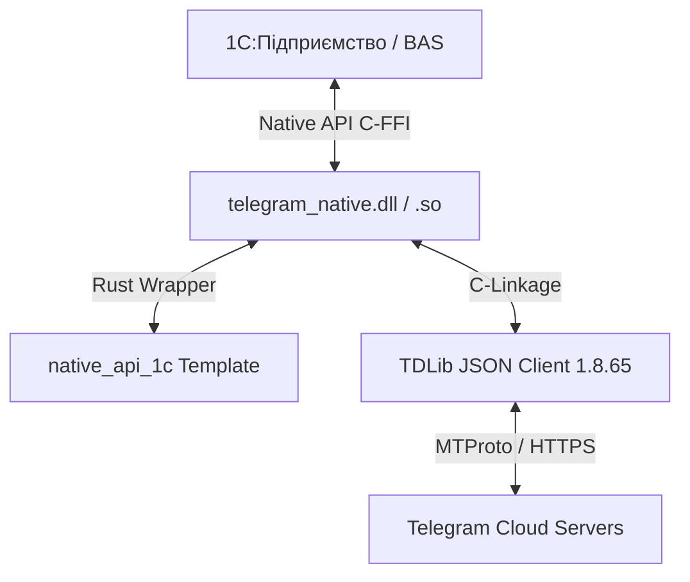

<div align="center">

# ⚡ Telegram Native for 1C:Enterprise / BAS

<p align="center">
  <b>Сучасна, супершвидка та безпечна Native API компонента для 1С:Підприємство та BAS мовою Rust на базі TDLib 1.8.65</b>
</p>

[](https://www.rust-lang.org/)
[](https://github.com/tdlib/td)
[](https://1c.ru)
[](LICENSE_1_0.txt)

---

</div>

## 🌟 Основні переваги

- 🦀 **Написано на Rust**: Нульова ймовірність витоків пам'яті, висока стабільність та максимальна швидкість обробки даних.
- ⚡ **Підтримка TDLib 1.8.65**: Повний доступ до всіх можливостей Telegram JSON API (боти, особисті акаунти, канали, групи, завантаження та надсилання файлів).
- 💻 **Кросплатформеність**: Готові збірки під **Windows (x86, x64)** та **Linux (x86, x64)**.
- 🔄 **Асинхронний режим**: Отримання сповіщень та нових повідомлень Telegram у фоновому режимі без замирання інтерфейсу 1С.
- 📦 **Готовий пакет 1С (`AddIn.zip`)**: Завантажуйте ZIP-архів безпосередньо в конфігурацію 1С як макет.

---

## 🏛 Архітектура та сумісність



### Підтримувані операційні системи:
- 🪟 **Windows**: x86 (32-bit), x64 (64-bit)
- 🐧 **Linux**: x86 (32-bit), x64 (64-bit)

---

## 🚀 Швидкий старт в 1С

```bsl
// 1. Підключення компоненти з макету або файлу AddIn.zip
Якщо Не ПодключитьВнешнююКомпоненту("ОбщийМакет.TelegramNative", "TelegramNative", ТипВнешнейКомпоненты.Native) Тогда
    ВызватьИсключение "Не вдалося подключити зовнішню компоненту TelegramNative!";
КонецЕсли;

// 2. Створення екземпляра об'єкта
Телеграм = Новый("AddIn.TelegramNative.TelegramNative");

// 3. Синхронне виконання легких запитів
ПараметрИмя = "{""@type"":""getOption"",""name"":""version""}";
Версия = Телеграм.Выполнить(ПараметрИмя);
Сообщить("Версія TDLib: " + Версия);

// 4. Включення асинхронного режиму для фонового отримання подій
Телеграм.ИмяИсточникаСобытий = "TelegramNative";
Телеграм.УстановитьАсинхронныйРежим(Истина);
```

---

## 📚 Таблиця API

### Властивості

| Англійська назва | Російська назва | Тип | Опис |
| :--- | :--- | :--- | :--- |
| `EventSourceName` | `ИмяИсточникаСобытий` | Рядок | Назва джерела події при генерації зовнішньої події в 1С. |

### Методи

| Англійська назва | Російська назва | Тип | Опис |
| :--- | :--- | :--- | :--- |
| `Send(Request)` | `Отправить(Запрос)` | Процедура | Асинхронна відправка JSON-запиту в TDLib. |
| `Receive()` | `Получить()` | Функція | Отримання наступної JSON-відповіді або оновлення від TDLib. |
| `Execute(Request)` | `Выполнить(Запрос)` | Функція | Синхронний виклик JSON-запиту в TDLib. |
| `SetAsyncMode(Enable)` | `УстановитьАсинхронныйРежим(Включить)` | Процедура | Управління фоновим потоком обробки оновлень. |
| `SetLogFilePath(Path)` | `УстановитьФайлЖурнала(Путь)` | Функція | Встановлення шляху для логування TDLib. |
| `SetLogMaxFileSize(Size)` | `УстановитьМаксимальныйРазмерФайлаЖурнала(Размер)` | Процедура | Встановлення максимального розміру лог-файлу. |
| `SetLogVerbosityLevel(Level)` | `УстановитьУровеньДетализацииЖурнала(Уровень)` | Процедура | Встановлення деталізації логування TDLib (0-10). |

---

## 🛠 Збірка з вихідного коду

### Вимоги:
- [Rust toolchain](https://rustup.rs/) (`1.70+`)
- TDLib 1.8.65

### Команда збірки:
```bash
cargo build --release
```

Скомпільована динамічна бібліотека буде знаходитись у теці `target/release/`:
- Windows: `telegram_native.dll`
- Linux: `libtelegram_native.so`

---

## 📖 Документація

- 📘 [Детальне керівництво з використання компоненти в 1С](docs/usage_1c.md)
- 📙 [План переходу на Rust та архітектура](docs/rust_transition_plan.md)

---

## 📄 Ліцензія

Проект розповсюджується під ліцензією [Boost Software License 1.0](LICENSE_1_0.txt).
